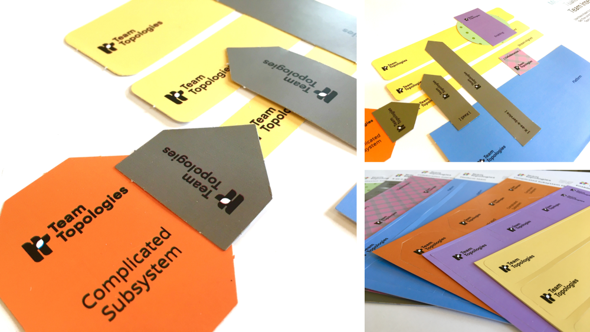
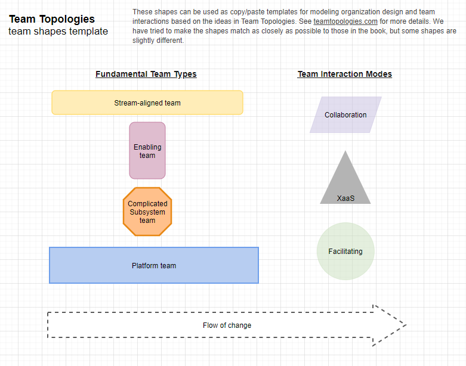

# Team Shape Templates

Templates for popular drawing and diagramming software tools to represent the team types and team interaction modes in Team Topologies.

Based on some of the ideas in the book _Team Topologies_ by Matthew Skelton [@matthewskelton](https://github.com/matthewskelton) and Manuel Pais [@manupaisable](https://github.com/manupaisable).

> See [teamtopologies.com](https://teamtopologies.com/) for more details about Team Topologies.

> Copyright © 2018-2021 [Team Topologies](https://teamtopologies.com/) - Licenced under [CC BY-SA 4.0](https://creativecommons.org/licenses/by-sa/4.0/) 

## Printed and printable shapes available

Get printed, pre-cut versions of these [team modeling shapes via Agile Stationery](https://agilestationery.com/products/modeling-shapes-for-team-types-and-team-interactions). These shapes are designed by the authors of Team Topologies; they are printed on high-quality card stock, and ready-cut for immediate use. _CC BY-SA license_.

A self-printable [PDF version of the card team modeling shapes](https://teamtopologies.com/shop/modeling-shapes-for-team-types-and-team-interactions-pdf) is also available to download (but you will need to cut the shapes yourself using scissors or a craft knife). _CC BY-SA license_.

## Principles for using the shapes - both printed and digital

When using the team shapes to create your own diagrams there are a number of constraints that should be applied:

- There is always an implied **flow of change from left to right** in the diagram (with apologies to people more familiar with a right-to-left flow!).
- A key aspect of Stream-aligned teams is that they have end-to-end responsibility for a flow of change to the live services/systems, with no hand-offs to other teams. There should therefore be no other team between a Stream-aligned team and their customers/users (on the right of the diagram).
- Team shapes should be solid to represent their long-lived nature.
- Interaction mode shapes should be 50% transparency to represent the more short-lived nature of the interaction.
- Stream-aligned teams should generally never provide an X-as-a-Service directly. Instead, data or services from the Stream-aligned team should be made available "as a Service" via a platform of some kind.
- If an X-as-a-Service or Collaboration interaction crosses over multiple teams, it may be appropriate to use an black asterisk "\*" to clarify which teams are interacting

Remember these guidelines:

- Use diagrams as **a starting point for meaningful discussion**; they are visuals to drive conversations around needs and evolution.
- Any diagrams you create will be a "snapshot" of your current landscape; use them to visualize and present potential issues that may need to be addressed.

### Designed for color vision deficiency

The shapes have been designed with the specific intention of being usable by everyone including those that may have a color vision deficiency. For this reason, the following constraints should apply:

- Platform teams should always have square corners
- Stream-aligned teams should always be horizontally aligned with rounded corners
- Enabling teams should always be vertically aligned with rounded corners
- Complicated subsystem teams should always be an octagon
- An Undefined Team Type team should always be horizontally aligned with rounded corners and dotted border
- Collaboration should be indicated using a parallelogram
- Facilitation should be represented using a circle
- X-as-a-Service should be represented with a triangle, with the point of the triangle indicating the direction of the service being provided

The following images were generated using this [color blindness simulator](https://www.color-blindness.com/coblis-color-blindness-simulator/):

|                  Normal                  |                                   Proto                                    |                                    Deutero                                     | Tritano                                                                    | Monochrome                                                                           |
| :--------------------------------------: | :------------------------------------------------------------------------: | :----------------------------------------------------------------------------: | -------------------------------------------------------------------------- | ------------------------------------------------------------------------------------ |
|  |  |  |  |  |

### Key differences from the shapes in the book

The image below is an example of the shapes you may have seen in the book. You may notice that there are some clear differences between the shapes shown above and those you may have previously seen in the book. There are a number of reasons for this which are explained below.

|                          Book Shapes                          |                                     Tool Shapes                                     |
| :-----------------------------------------------------------: | :---------------------------------------------------------------------------------: |
|  |  |

- The X-as-a-Service interaction is a grey triangle instead of two white bars joining the two teams. The reason for the difference here is two-fold. First, the shape defined in the book does not indicate the direction of the interaction being provided; the point of the triangle now determines this (the triangle points towards the "customer" in the relationship). Second, the shape representing the X-as-a-Service interaction in the book was very difficult to re-create in a number of different diagramming tools; using a simple triangle makes this much easier.
- The Collaboration interaction is a parallelogram instead of a hatched square. Recreating the hatching in different diagramming tools was problematic so this was changed to use a parallelogram.
- The Facilitation interaction mode is a plain circle instead of a circle with dots. Recreating the dots in different diagramming tools was problematic so this was changed to use a circle.

## Available Team Shapes

The following team interaction modelling shapes are available:

- All shapes for the four fundamental team types (Stream-aligned, Enabling, Complicated Subsystem, and Platform)
- An undefined team type shape can be used to represent a team that currently has no team type determined
- X-as-a-Service, Collaboration and Facilitation interaction modes
- Flow of change

## Officially Supported Team Interaction Modelling Tools

The source code for team shapes that are officially developed and maintained by Team Topologies can be found within this repository. If you find an issue with any of the following templates please let us know or even better raise a pull request. Team shape templates are officially supported by Team Topologies for the following tools:

### draw.io / diagrams.net

See [TeamTopologies.xml](diagrams.net/TeamTopologies.xml) in the _diagrams.net_ folder. This creates a Library with several shapes. The shapes are named - hover over a shape to see the description:

#### Usage

You have a couple of options, simply click the following link to pre-load the library:

- [Open Diagrams.net with the Team Topologies Shape Libray](https://app.diagrams.net/?splash=0&ui=min&clibs=Uhttps%3A%2f%2fraw.githubusercontent.com%2fTeamTopologies%2fTeam-Shape-Templates%2fmaster%2fdiagrams.net%2fTeamTopologies.xml)

Or

- Download _[TeamTopologies.xml](diagrams.net/TeamTopologies.xml)_ from this repository
- Open diagrams.net in a browser
- File -> Open Library from -> Device
- Select the file _TeamTopologies.xml_

A new shape library should appear.

### Google Draw

Open the template at [Team Topologies Template for modelling - Google Draw](https://docs.google.com/drawings/d/1MxEb1bm1tez0aLaufEHUgv5AO7d577lRC1xdEtAFr1Q/copy?usp=sharing) and choose _Make a copy_

Then copy/paste the shapes as needed into Google Draw or Google Slides if needed.

### Google Slides

Open the template at [Team Topologies Template for modelling - Google Slides](https://docs.google.com/presentation/d/1jEqC5PQNeK57E8zB31SecBYA5H1K0SmER5erLYPOn-0/copy#slide=id.p) and choose _Make a copy_

### PowerPoint

Download the template from the [Team Topologies Template for modelling - PowerPoint](powerpoint/Team%20Topologies%20Template%20for%20modelling%20-%20PowerPoint.pptx) and start editing as needed

### Miro

- Download the latest release of the [Team Topologies Template for modelling - Miro](https://github.com/TeamTopologies/Team-Shape-Templates/releases) package
- Open Miro and click on _Upload from backup_
- This will create a new board called _Restored Team Topologies template for modelling - Miro_
- Then simply rename the board and start using it by copy and pasting the different shapes as required

See the [Miro Readme](miro/readme.md) for more details on how to edit the shapes for Miro.

## Community Supported Team Interaction Modelling Tools

The team shape templates in this list have been developed and are maintained by members of the wider Team Topologies community. If you find an issue with these templates, please contact the relevant template author. Team shape templates are supported by the extended community for the following tools:

### Figma

Open the template at [Team Topologies - Team shapes template - Figma Community](https://www.figma.com/community/file/1020627299699159564/Team-Topologies---Team-shapes-template) and choose _Duplicate_

### LucidChart

Open the template at [Team Topologies Template - Lucid Chart](https://lucid.app/lucidchart/ee8afe63-92f7-4e56-8e05-f3d57846caae/edit?invitationId=inv_c87d42eb-17e4-4e8c-94a7-849d9c2c919a) and create a new document based on the template.

## Contributing

Here are some guidelines to follow if you would like to contribute a shape set for your favourite modelling tool:

### Colors and Styles

Where possible the shapes should adhere to the following scheme:

| Shape Name                 | Fill: HEX(#RGB) | Fill Transparency | Outline: HEX(#RGB) | Outline Style | Outline Weight |
| -------------------------- | :-------------: | :---------------: | :----------------: | :-----------: | :------------: |
| Stream-aligned team        |     #FFEDB8     |        0%         |      #FFD966       |     Solid     |      2px       |
| Enabling team              |     #DFBDCF     |        0%         |      #D09CB7       |     Solid     |      2px       |
| Complicated Subsystem team |     #FFC08B     |        0%         |      #E88814       |     Solid     |      2px       |
| Platform team              |     #B7CDF1     |        0%         |      #6D9EEB       |     Solid     |      2px       |
| Undefined Team Type        |     #EBEBEF     |        0%         |      #9B99AF       |    Dotted     |      2px       |
| Collaboration              |     #C6BEDF     |        50%        |      #967EE2       |    Dashed     |      2px       |
| Facilitation               |     #C9DFBE     |        50%        |      #78996B       |    Dashed     |      2px       |
| X-as-a-Service             |     #B4B4B4     |        50%        |      #999696       |    Dashed     |      2px       |

The contrast of the shapes will be better on a white background.

### Shape Re-sizing

The following table shows some typically re-sizing actions that may be performed by the user, any shapes created should support this type of re-sizing.

| Shape Type                                                                                                                                                                |                                    Example                                     |
| ------------------------------------------------------------------------------------------------------------------------------------------------------------------------- | :----------------------------------------------------------------------------: |
| Stream-aligned and Platform teams will typically be re-sized horizontally. They may increase in size vertically to indicate the size of the team relative to others. |  |
| Enabling teams are typically re-sized vertically. They may increase in size horizontally to accommodate the name of the team.                                        |                         |
| Complicated subsystem teams are typically re-sized both horizontally and vertically in order to accommodate the team name.                                                |          |
