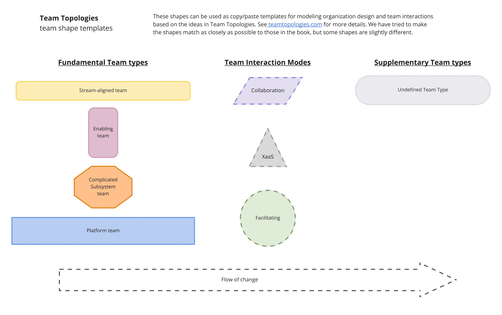

# Team Shape Templates

Templates for popular drawing and diagramming tools to represent the team types and team interaction modes in Team Topologies.

Based on some of the ideas in the book _Team Topologies_ by Matthew Skelton [@matthewskelton](https://github.com/matthewskelton) and Manuel Pais [@manupaisable](https://github.com/manupaisable).

> See [teamtopologies.com](https://teamtopologies.com/) for more details about Team Topologies.

> Copyright © 2018-2020 [Team Topologies](https://teamtopologies.com/) - Licenced under [CC BY-SA 4.0](https://creativecommons.org/licenses/by-sa/4.0/) 

## draw.io / diagrams.net

See [TeamTopologies.xml](diagrams.net/TeamTopologies.xml) in the _diagrams.net_ folder. This creates a Library with several shapes. The shapes are named - hover over a shape to see the description:

### Currently supported

* All shapes for the four fundamental team types (Stream-aligned, Enabling, Complicated Subsystem, and Platform) and the X-as-a-Service interaction mode

* Collaboration and Facilitation interaction modes

### Usage

You have a couple of options, simply click the following link to pre-load the library:

- [Open Draw.io with the Team Topologies Shape Libray](https://app.diagrams.net/?splash=0&ui=min&clibs=Uhttps%3A%2f%2fraw.githubusercontent.com%2fTeamTopologies%2fTeam-Shape-Templates%2fmaster%2fdiagrams.net%2fTeamTopologies.xml)

Or

* Download _[TeamTopologies.xml](diagrams.net/TeamTopologies.xml)_ from this repository
* Open diagrams.net in a browser
* File -> Open Library from -> Device
* Select the file _TeamTopologies.xml_

A new shape library should appear. 

## Google Draw 

Open the template at [Team Topologies Template for modelling - Google Draw](https://docs.google.com/drawings/d/1MxEb1bm1tez0aLaufEHUgv5AO7d577lRC1xdEtAFr1Q/copy?usp=sharing) and choose _Make a copy_

Then copy/paste the shapes as needed into Google Draw or Google Slides if needed.

## Google Slides

Open the template at [Team Topologies Template for modelling - Google Slides](https://docs.google.com/presentation/d/1jEqC5PQNeK57E8zB31SecBYA5H1K0SmER5erLYPOn-0/copy#slide=id.p) and choose _Make a copy_

## PowerPoint

Download the template from the [Team Topologies Template for modelling - PowerPoint.pptx](powerpoint/Team%20Topologies%20Template%20for%20modelling%20-%20PowerPoint.pptx) and start editing as needed

## Miro

TBC